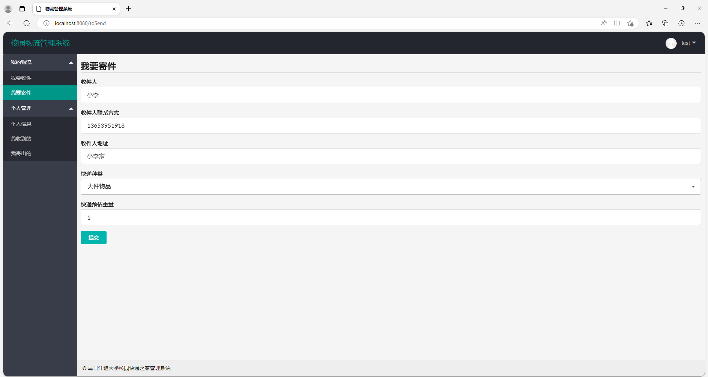
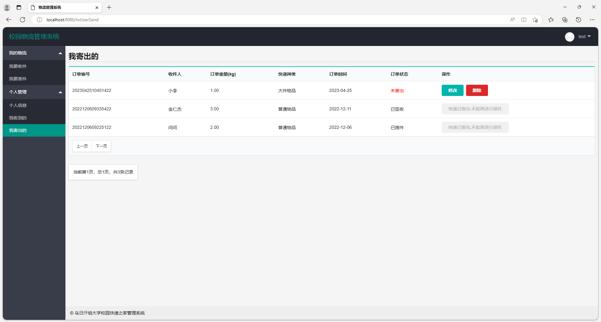
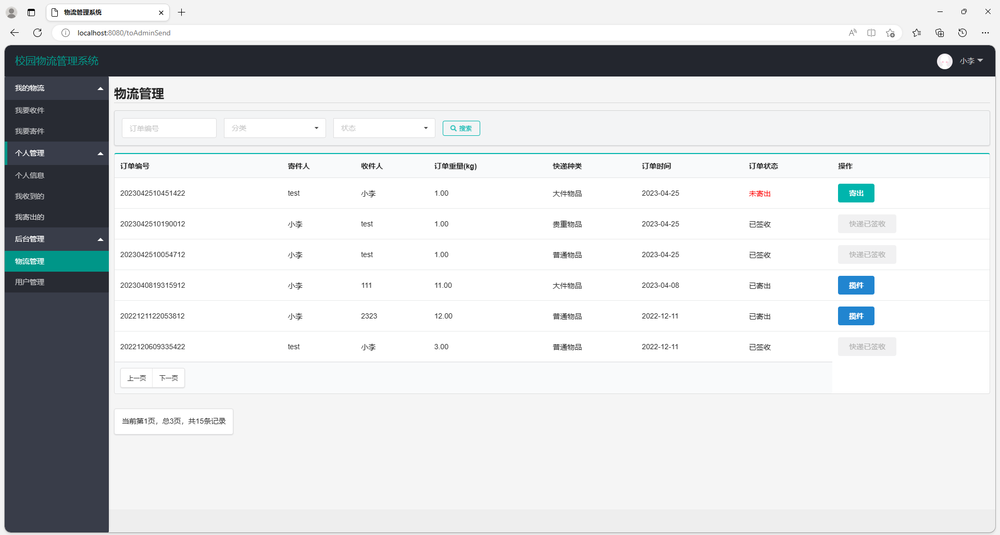
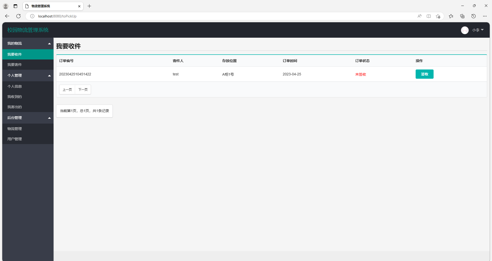
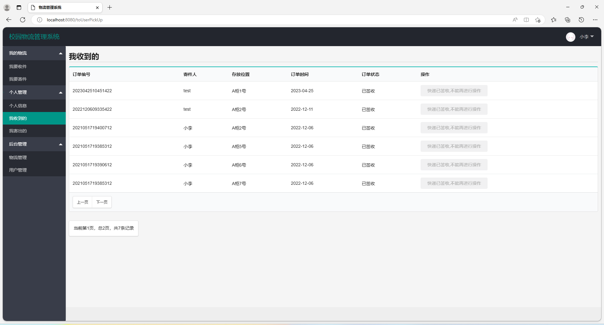

# 校园快递管理系统

## 一、项目介绍

基于springboot的校园快递管理系统

运行环境:idea或eclipse 数据库:mysql

开发语言：java

项目技术

SpringBoot+MybatisPlus+Thymeleaf+jquery+layui

主要功能
我的物流
我要收件
我要寄件
个人管理
个人信息
我收到的
我寄出的
后台管理
物流管理
用户管理

## 二、系统部分功能页面截图

### 1、用户模块部分功能页面截图

### 管理员模块部分功能页面截图

### 9.9￥ 获取完整源码+sql，需要加Q：3808981644 备用Q：3577148218
### 有问题，或者需要协助调试运行项目的也可联系

